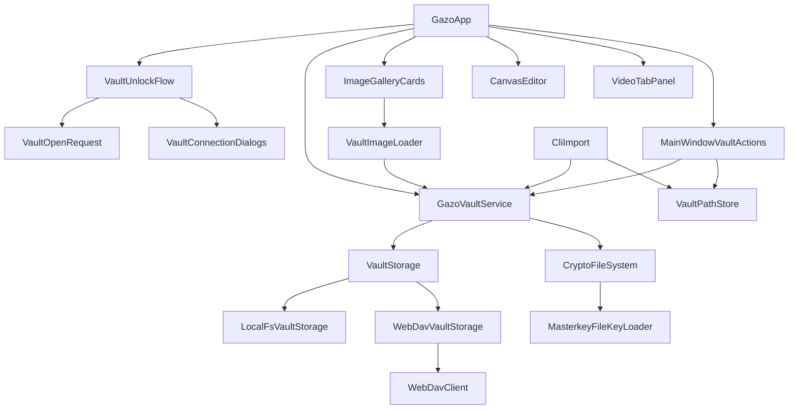

# Gazo 設計書

## 1. 概要

### 1.1 目的

Gazo は、Cryptomator 互換 Vault に画像・動画を暗号化保存し、ギャラリー表示・タグ管理・キャンバス編集・重複/類似検出などを行う JavaFX デスクトップアプリケーションである。

### 1.2 技術スタック

| 項目 | 内容 |
|------|------|
| 言語 | Java 17 |
| UI | JavaFX 21（controls, graphics, media） |
| 暗号化 | Cryptomator cryptofs 2.6.4 / cryptolib |
| ビルド | Gradle 8+ |
| テスト | JUnit 5, Mockito |

### 1.3 エントリポイント

- **GUI**: `com.example.gazo.GazoApp` — `Application.launch()` で JavaFX アプリを起動
- **CLI**: 先頭引数が `import` のとき `CliImport.tryRun()` が Vault へ取り込み後 `System.exit()` する（GUI は起動しない）

---

## 2. アーキテクチャ

### 2.1 レイヤ構成

```
┌─────────────────────────────────────────────────────────────┐
│  Presentation (JavaFX)                                       │
│  GazoApp, GazoFx, CanvasHubDialog, DuplicateCheckWindow, …   │
├─────────────────────────────────────────────────────────────┤
│  Application Services                                        │
│  MainWindowVaultActions, VaultUnlockFlow, GalleryToolbar, …  │
├─────────────────────────────────────────────────────────────┤
│  Domain / Vault                                              │
│  GazoVaultService, UserTags, TagFilter, ImportFileType, …    │
├─────────────────────────────────────────────────────────────┤
│  Storage Abstraction                                         │
│  VaultStorage ← LocalFsVaultStorage / WebDavVaultStorage     │
├─────────────────────────────────────────────────────────────┤
│  External                                                    │
│  Cryptomator CryptoFS, WebDAV サーバー, ローカルファイルシステム │
└─────────────────────────────────────────────────────────────┘
```

### 2.2 主要コンポーネント関係



### 2.3 起動シーケンス

1. `GazoApp.main()` — CLI 引数を `CliImport` に委譲
2. `WebDavCacheLifecycle.onStartupBeforeVaultOpen()` — セッションマーカー記録
3. `VaultPathStore.loadInitialVaultConnection()` — 前回接続先を復元
4. `VaultUnlockFlow.openVaultAsync()` — パスフレーズ入力 → Vault 解錠
5. `continueApplicationAfterVaultOpened()` — UI 構築、ギャラリー初期表示
6. WebDAV の場合 `triggerWebDavBackgroundSync()` — バックグラウンド差分同期

---

## 3. Vault データモデル

### 3.1 Cryptomator Vault 構造

Vault ルート（解錠後の平文ビュー）には以下のディレクトリ・ファイルが存在する。

| パス | 説明 |
|------|------|
| `images/` | オリジナル画像 |
| `videos/` | 動画ファイル |
| `thumbnails/` | サムネイル（JPEG） |
| `.gazo-tags.properties` | ファイル名 → タグ集合 |
| `.gazo-display.properties` | 表示関連メタデータ |
| `.gazo-canvas.properties` | キャンバス選択順・レイアウト名 |
| `.gazo-canvas-transform.properties` | キャンバス上の位置・サイズ・回転 |
| `.gazo-trash/` | 論理削除された画像・サムネ・インデックス |

Cryptomator 標準ファイル（`vault.cryptomator`, `masterkey.cryptomator` 等）は Vault ルート直下に配置される。

### 3.2 接続先モデル

`VaultConnection` が接続種別を表す。

- **LOCAL**: ローカルディレクトリパス
- **WEBDAV**: エンドポイント URL、Vault ベースパス、ユーザー名

WebDAV パスワードは `VaultPathStore` に暗号化して保存可能（`WebDavPasswordCodec`）。Vault パスフレーズは保存しない。

### 3.3 アプリ設定（`~/.gazo/settings.properties`）

| キー | 内容 |
|------|------|
| `lastVaultPath` / `lastVaultType` | 前回 Vault 接続先 |
| `lastWebDavEndpoint` 等 | WebDAV 接続情報 |
| `lastWebDavPasswordEnc` | WebDAV パスワード（暗号化） |
| `gallery.*` | ギャラリー表示・フィルター設定 |
| `conflict.dhash.*` | WebDAV 競合時の dHash しきい値 |
| `physicalBackupMirror.*` | 物理バックアップ先（接続先ごと） |

---

## 4. ストレージ層

### 4.1 VaultStorage インターフェース

```java
interface VaultStorage {
    Path localVaultPath();      // 作業用ローカルパス
    String displayLocation();   // UI 表示用文字列
    boolean isRemote();
    void prepareForOpen();
    void flushChanges();
    String syncStatusSummary();
}
```

### 4.2 LocalFsVaultStorage

- Vault ディレクトリをそのまま `localVaultPath()` として使用
- リモート同期なし

### 4.3 WebDavVaultStorage

- ローカルキャッシュ（`~/.gazo/webdav-cache/` 配下）にミラー
- `WebDavClient` で PROPFIND / GET / PUT / DELETE
- 起動時 `prepareForOpen()` でキャッシュが使える場合は同期をスキップし、UI 表示後に `runBackgroundDownSyncIfNeeded()` で差分同期
- 競合検出時 `WebDavSyncConflictException` → `GazoFx.showWebDavConflictDialog()` で解決
- 進捗は `WebDavSyncProgress` 経由で UI に通知

### 4.4 競合解決

`WebDavConflictResolution` 列挙:

| 値 | 動作 |
|----|------|
| KEEP_LOCAL | ローカル版を優先して上書き |
| KEEP_REMOTE | リモート版を取り込み |
| SAVE_AS_CONFLICT_COPY | `(conflict yyyyMMdd-HHmmss)` 付きで別名保存 |
| CANCEL | 同期中断 |

画像競合では dHash（64bit perceptual hash）距離で「ほぼ同一」「近い」を判定。しきい値は `VaultPathStore.ConflictDHashThresholds` で永続化（デフォルト: same≤3, near≤8）。

---

## 5. コアサービス: GazoVaultService

### 5.1 責務

- Vault 作成・解錠・クローズ（Cryptomator CryptoFS）
- 画像/動画のインポート・削除・復元
- サムネイル生成・再作成
- タグ CRUD（`.gazo-tags.properties`）
- キャンバス状態の永続化
- 類似画像ペア検出（dHash）
- 物理バックアップ・ミラー同期
- WebDAV flush / 競合処理

### 5.2 解錠フロー

1. `prepareStorageIfNeeded()` — ストレージ準備（WebDAV ならキャッシュ同期）
2. `CryptoFileSystemProvider.initialize()` — パスフレーズで CryptoFS マウント
3. `MasterkeyFileKeyLoader` — `masterkey.cryptomator` をパスフレーズで復号

### 5.3 インポート処理

- 対応画像: `.jpg`, `.jpeg`, `.png`, `.gif`, `.bmp`, `.webp`（`ImportFileType`）
- 対応動画: `.mp4`, `.webm`, `.m4v`, `.mov`, `.mkv`
- インポート時にサムネイル自動生成
- フォルダ取り込み時は `ImportFolderTagging` でフォルダ名をタグとして付与可能

---

## 6. UI 層

### 6.1 メインウィンドウ（GazoApp）

3 タブ構成:

| タブ | コンポーネント | 役割 |
|------|----------------|------|
| キャンバス | `HomeCanvasPreview` | ランダムキャンバスプレビュー、スライドショー起動 |
| 画像 | `ImageGalleryCards` + `GalleryToolbar` | 仮想スクロールギャラリー、タグ/検索フィルター |
| 動画 | `VideoTabPanel` | 動画一覧・再生 |

ステータスバー: Vault 接続先、同期状態、インポート進捗、接続先切替ボタン。

### 6.2 仮想スクロール（ImageGalleryCards）

大量画像対応のため、可視領域＋バッファ分のみ FlowPane にカードを描画する。

- `GalleryVirtualState` — 列数・行高・ウィンドウ範囲
- `GalleryVirtualWindow` — 表示範囲計算
- `ImageGalleryLayoutMetrics` — カードサイズ（小/中/大）

### 6.3 キャンバス機能

| クラス | 役割 |
|--------|------|
| `CanvasHubDialog` | キャンバス統合 UI（選択・ランダムピック・保存・スライドショー） |
| `CanvasEditor` | レイアウト描画・自動配置・変形操作 |
| `SlideshowWindow` | フルスクリーン風スライドショー |
| `HomeCanvasPreview` | メインタブのプレビュー |

レイアウトプリセット: 「コラージュ風」「整列風」。複数キャンバス名（レイアウト名）を Vault に保存可能。

### 6.4 重複/類似チェック

- `DuplicateCheckWindow` → `DuplicateCheckSession` — UI とスキャンロジック
- `GazoVaultService` の dHash ベース類似ペア検出
- 削除は `PendingDeletePaths` で遅延実行（ダイアログ終了時またはアプリ終了時に flush）
- CPU 集約処理は `vaultHeavySerialExecutor`（単一スレッド）で直列化

### 6.5 共通 UI ユーティリティ

- `GazoFx` — ダイアログ、アイコン、WebDAV 競合 UI、dHash 計算
- `GazoMenuBarFactory` — メニューバー生成
- `MainWindowBusyState` — 処理中オーバーレイ制御

---

## 7. 並行処理モデル

| Executor | 用途 |
|----------|------|
| JavaFX Application Thread | UI 更新専用 |
| `vaultHeavySerialExecutor` | 重複チェック等の CPU/IO 集約処理 |
| `webDavBackgroundSyncExecutor` | WebDAV バックグラウンド差分同期 |
| `MIGRATION_EXECUTOR`（MainWindowVaultActions） | Vault 移行・物理コピー |
| `ImageGalleryCards` 内 executor | サムネイル非同期読み込み |

WebDAV 同期進捗はリスナー経由で `Platform.runLater()` により UI スレッドへ反映する。

---

## 8. Vault 切替・移行

`MainWindowVaultActions.changeVaultPath()` が以下のモードを提供:

| モード | 説明 |
|--------|------|
| SWITCH_ONLY | 接続先切替のみ |
| COPY_AND_MIGRATE | 平文スナップショット経由でコピー、件数検証 |
| COPY_VAULT_SIMPLE | 平文直接コピー |
| COPY_PHYSICAL_MIGRATE | 暗号化 Vault をバイトコピー（WebDAV 先は空である必要あり） |

物理バックアップ機能:

- **アルバムを物理バックアップ** — ワンショットコピー
- **物理バックアップ先を登録** — 接続先ごとにミラー先を `settings.properties` に保存
- **バックアップと同期** — 登録済みミラーとの同期

---

## 9. セキュリティ設計

### 9.1 暗号化

- Cryptomator SIV_GCM 方式
- Vault パスフレーズはメモリ上の `char[]` で保持し、使用後 `Arrays.fill()` でゼロ埋め
- Vault パスフレーズはディスクに保存しない

### 9.2 認証情報

- WebDAV パスワード: `WebDavPasswordCodec` で暗号化保存（マシン依存）
- CLI の `--password` / `--webdav-password` はシェル履歴に残るため非推奨
- 推奨: 環境変数 `GAZO_PASSPHRASE`, `GAZO_WEBDAV_PASSWORD`

### 9.3 削除

- 画像削除は `.gazo-trash/` へ移動（論理削除）
- 「最近削除した画像を復元」で一定期間復元可能
- `PendingDeletePaths` による遅延物理削除は重複整理フロー専用

---

## 10. 外部依存

| ライブラリ | 用途 |
|-----------|------|
| org.cryptomator:cryptofs | Cryptomator 互換ファイルシステム |
| commons-io | ファイル操作ユーティリティ |
| slf4j-simple | ログ（runtime） |

---

## 11. ビルド・配布

| Gradle タスク | 成果物 |
|---------------|--------|
| `build` | コンパイル + テスト |
| `run` | GUI 起動（ヒープ 256m〜2g） |
| `fatJar` | `build/libs/gazo-1.0-SNAPSHOT-all.jar` |
| `jpackageWin` | `build/jpackage/Gazo/`（Windows app-image） |

JavaFX ネイティブライブラリは OS 依存のため、配布 JAR はターゲット OS でビルドすること。

---

## 12. テスト構成

`src/test/java/com/example/gazo/` にユニットテスト:

- `TagFilterTest`, `UserTagsTest` — タグフィルター
- `GalleryVirtualStateTest`, `ImageGalleryLayoutMetricsTest` — ギャラリーレイアウト
- `VaultConnectionTest`, `VaultOpenRequestTest` — 接続モデル
- `WebDavPasswordCodecTest` — パスワード暗号化
- `ImportFileTypeTest`, `PendingDeletePathsTest` — インポート・削除
- `MainWindowBusyStateTest`, `HomeCanvasPreviewTest` — UI 状態

`VaultPathStore.configFileOverrideForTests` で設定ファイルパスをテスト用に差し替え可能。

---

## 13. パッケージ構成

```
com.example.gazo
├── GazoApp.java              # メインアプリケーション
├── GazoFx.java               # 共通ダイアログ
├── cli/CliImport.java        # CLI 取り込み
├── vault/
│   ├── GazoVaultService.java # Vault コア
│   ├── VaultStorage.java     # ストレージ抽象
│   ├── LocalFsVaultStorage.java
│   ├── WebDavVaultStorage.java
│   ├── WebDavClient.java
│   └── …
├── CanvasEditor.java         # キャンバス編集
├── CanvasHubDialog.java      # キャンバス統合 UI
├── ImageGalleryCards.java    # ギャラリー
├── DuplicateCheckSession.java # 重複チェック
├── MainWindowVaultActions.java # Vault 操作
└── …
```

---

## 14. 将来の拡張ポイント

- **VaultStorage 実装追加**: S3 等のリモートストレージは `VaultStorage` + `VaultStorageFactory` を拡張
- **インポート形式**: `ImportFileType` に拡張子を追加
- **キャンバスレイアウト**: `CanvasEditor` のプリセット追加
- **類似検出アルゴリズム**: `GazoVaultService` / `DuplicateCheckSession` 内の dHash ロジック
